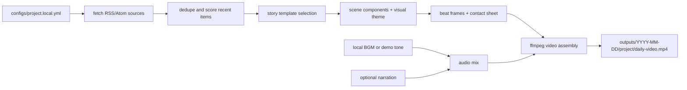

# Architecture

The public project keeps the reusable mechanism and moves private judgment into local ignored files.

## Public Boundary

Keep in source control:

- generic collection adapters
- example configuration with disabled placeholder sources
- demo items with fake domains
- video rendering code
- composable story templates, scene components, and visual themes
- privacy scan tooling
- docs and tests

Keep local only:

- real source lists and account names
- private source domains
- personal topic filters and watchlists
- portfolio or account exports
- private strategy notes
- generated reports, videos, frames, captions, and logs
- API tokens and cookies

## Extension Points

- Add new source adapters in `src/daily_video_pipeline/fetchers.py`.
- Add selection logic in `src/daily_video_pipeline/selection.py`.
- Add templates, scene components, and themes in `src/daily_video_pipeline/templates.py`.
- Add new component rendering families in `src/daily_video_pipeline/renderer.py`.
- Add personal publish steps in a separate ignored local script.
